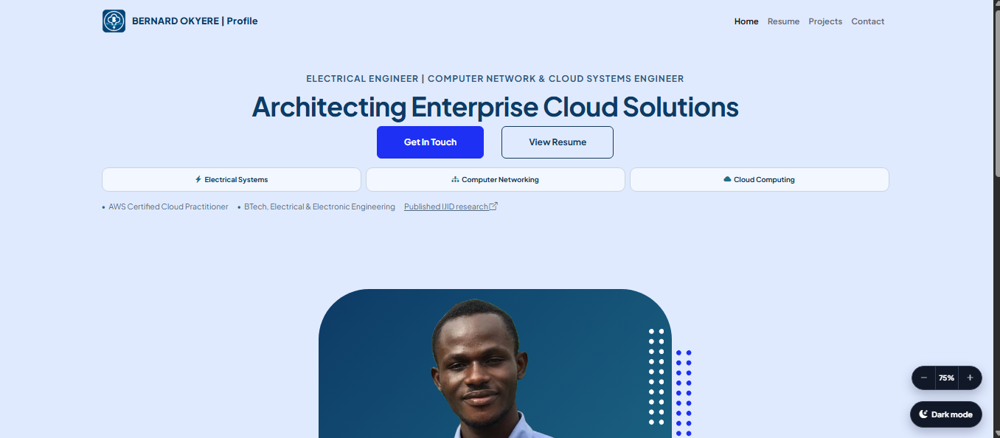
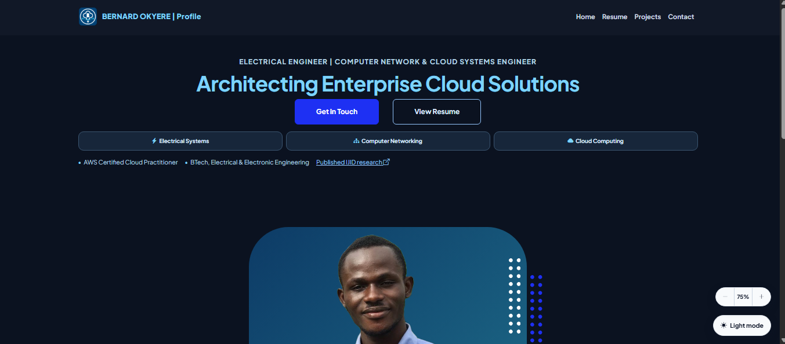
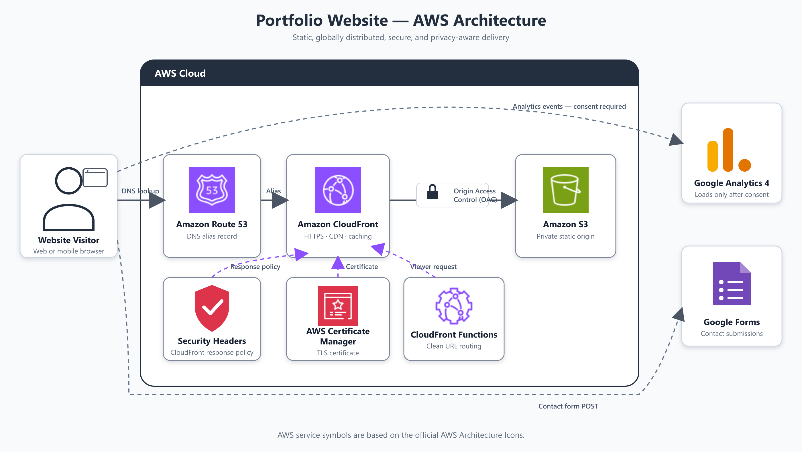

# Bernard Okyere — Engineering Portfolio

[](https://bernardokyere.com/)
[](https://aws.amazon.com/)

A responsive personal portfolio for Bernard Okyere, an Electrical Engineer focused on computer networking, cloud systems, industrial electrical systems, maintenance, and automation.

The website presents My professional profile, work experience, education, certifications, technical skills, downloadable résumé, research publication, and contact form.

**Live website:** [bernardokyere.com](https://bernardokyere.com/)

## Screenshots
- Light Theme


- Dark Theme

  
## Features

- Responsive layout for desktop, tablet, and mobile screens
- Visitor-system theme detection with optional light/dark theme control
- Page zoom controls from 50% to 200%
- Clean URLs such as `/resume`, `/projects`, and `/contact`
- Downloadable PDF résumé
- Downloadable research publication
- Contact form integrated with Google Forms
- Google Analytics 4 integration loaded only after analytics consent
- Privacy notice and persistent cookie-choice controls
- Automatic copyright year
- Accessible labels, semantic page structure, keyboard-friendly controls, and descriptive image text
- CloudFront security headers and a private S3 origin

## Technology Stack

| Area | Technology |
|---|---|
| Front end | HTML5, CSS3, JavaScript |
| UI framework | Bootstrap 5 |
| Icons | Bootstrap Icons |
| Typography | Google Fonts — Plus Jakarta Sans |
| Hosting | Amazon S3 |
| Content delivery | Amazon CloudFront |
| DNS | Amazon Route 53 |
| TLS certificate | AWS Certificate Manager |
| URL routing | CloudFront Functions |
| Origin security | CloudFront Origin Access Control |
| Contact processing | Google Forms |
| Analytics | Google Analytics 4 |

## Architecture



### Request Flow

1. Route 53 resolves `bernardokyere.com` to the CloudFront distribution.
2. CloudFront receives the HTTPS request and runs the viewer-request CloudFront Function.
3. The function maps clean routes to their S3 objects—for example, `/projects` to `/projects.html`.
4. CloudFront retrieves files from the private S3 bucket through Origin Access Control.
5. CloudFront applies the response headers policy, caches the response, and returns it to the visitor.
6. Contact submissions are posted directly from the browser to Google Forms.
7. Google Analytics loads only when the visitor accepts analytics cookies.

## Project Structure

```text
.
├── assets/
│   ├── Bernard-Okyere-Resume.pdf
│   ├── litter-detection-publication.pdf
│   ├── litter-detection-output-sample.png
│   ├── profile.png
│   └── favicon.ico
├── css/
│   └── styles.css
├── js/
│   └── scripts.js
├── contact.html
├── index.html
├── projects.html
├── resume.html
```

## Pages

| Route | Source file | Purpose |
|---|---|---|
| `/` | `index.html` | Profile, engineering focus, services, and key credentials |
| `/resume` | `resume.html` | Experience, professional skills, tools, education, and certifications |
| `/projects` | `projects.html` | Engineering projects and publications |
| `/contact` | `contact.html` | Contact form and professional contact information |

The CloudFront Function also supports `/profile` as an alternative route to the home page and redirects legacy or trailing-slash URLs to their canonical forms.

## AWS Deployment

### Prerequisites

- An AWS account
- A registered domain
- An S3 bucket containing the website files
- A CloudFront distribution
- A public ACM certificate in the `us-east-1` Region for CloudFront
- A Route 53 hosted zone for the domain

### Deployment Steps

1. Uploaded the project files to the S3 bucket while preserving the directory structure.
2. Kept the S3 bucket private and allowed access through CloudFront Origin Access Control.
3. Set `index.html` as the CloudFront default root object.
4. Published `cloudfront-clean-urls.js` as a CloudFront Function.
5. Associated the function with the distribution's **Viewer request** event.
6. Attached the required CloudFront response headers policy.
7. Pointed Route 53 alias records for the root domain to the CloudFront distribution.
8. After uploading a release, created a CloudFront invalidation for:

   ```text
   /*
   ```

9. Verified the home, résumé, projects, contact, document-download, form-submission, consent, and dark-mode behaviour.

### Clean URL Mapping

The included CloudFront Function maps visitor-facing routes to S3 objects:

```text
/profile   → /index.html
/resume    → /resume.html
/projects  → /projects.html
/contact   → /contact.html
```

It also redirects `/index.html` to `/` and removes trailing slashes from recognised page routes.

## Security and Privacy

The production architecture uses:

- HTTPS through CloudFront and AWS Certificate Manager
- A private S3 bucket protected by Origin Access Control
- HTTP Strict Transport Security
- Content Security Policy
- Clickjacking protection
- MIME-type sniffing protection
- Referrer and Permissions policies
- Restricted CloudFront methods for the static origin
- Consent-gated Google Analytics
- A privacy notice describing analytics and contact-form processing

The repository contains no private API keys or server-side credentials. Google Analytics measurement identifiers and Google Form field identifiers are public browser-side configuration values, not authentication secrets.

## Contact Form

The contact page submits the following required fields to Google Forms:

- Affiliated company or institution
- Name
- Email address
- Phone number, including optional international country code
- Message

JavaScript captures the form data before clearing the fields, sends it to the Google Forms endpoint, and displays an inline confirmation without navigating away from the portfolio.

If the Google Form is replaced or its questions are recreated, both the form endpoint and the corresponding `entry.*` field names in `contact.html` must be updated.

## Analytics and Consent

Google Analytics is not loaded automatically. On a visitor's first visit:

1. The website presents a privacy choice.
2. Accepting analytics loads the GA4 tag and grants analytics storage.
3. Rejecting analytics prevents the tag from loading.
4. The choice is retained across page navigation.
5. The visitor can reopen **Cookie settings** from the footer and change the choice.

## Challenges

### Clean URLs on Static Hosting

S3 stores physical files such as `projects.html`, while the public website needed readable routes such as `/projects`. Requests ending with a slash could also make browsers resolve assets from the wrong path and cause styling to disappear.

This was solved with a CloudFront viewer-request function, canonical redirects, and root-relative links for pages and assets.

### CloudFront and Browser Caching

Updated HTML, CSS, and JavaScript did not always appear immediately because both CloudFront and visitors' browsers could retain older versions.

CloudFront invalidations were added to the release workflow, and version query strings were used for important CSS and JavaScript updates.

### Reliable Document Downloads

A publication initially used a long filename containing special characters. A mismatch between the linked path and the S3 object key produced an `AccessDenied` response.

The asset was renamed to the short, URL-safe `litter-detection-publication.pdf`, and the page link was updated to match the exact S3 key.

### Google Forms Integration

The contact form appeared successful but could clear its fields before the browser completed the submission. Because cross-origin `no-cors` requests return opaque responses, the front end also cannot inspect Google Forms' response body.

The submission handler now captures `FormData` first, sends it to Google Forms, and resets the interface only after the request is dispatched.

### Persistent Privacy Choice

The analytics banner originally reappeared during navigation even after a choice had been made.

Consent handling was refined to retrieve the existing choice before showing the banner and to retain it through local storage, session storage, a first-party cookie, and a navigation fallback.

### Consistent Responsive Presentation

The résumé, project, and contact pages contained cards with different widths, text styles, and layouts. Dates and long content also behaved differently on small displays.

Shared typography, colour, spacing, responsive card rules, justified body copy, and mobile breakpoints were consolidated in the main stylesheet.

## Lessons Learned

- Design static-site routing and canonical URLs before publishing links.
- Use root-relative paths when a site is served from several clean routes.
- Keep cloud object names short, lowercase, and URL-safe.
- Treat cache invalidation and asset versioning as part of every deployment.
- Capture form data before resetting or changing a form's interface.
- Test integrations at their destination, not only through a success message in the browser.
- Build privacy controls into analytics from the beginning.
- Keep S3 private and place public delivery, TLS, caching, and security headers at CloudFront.
- Verify changes on mobile devices, multiple pages, light and dark themes, and a private browsing session.
- Document manual cloud configuration because it is as important as the front-end source code.

## Future Improvements

- Manage the AWS infrastructure with AWS CloudFormation, AWS CDK, or Terraform
- Add an automated deployment pipeline with GitHub Actions
- Add automated HTML, accessibility, and broken-link checks
- Add CloudFront access logs and an operational dashboard
- Add social sharing metadata and a generated Open Graph image
- Replace the third-party form endpoint with a serverless API if delivery confirmation or custom validation becomes necessary
